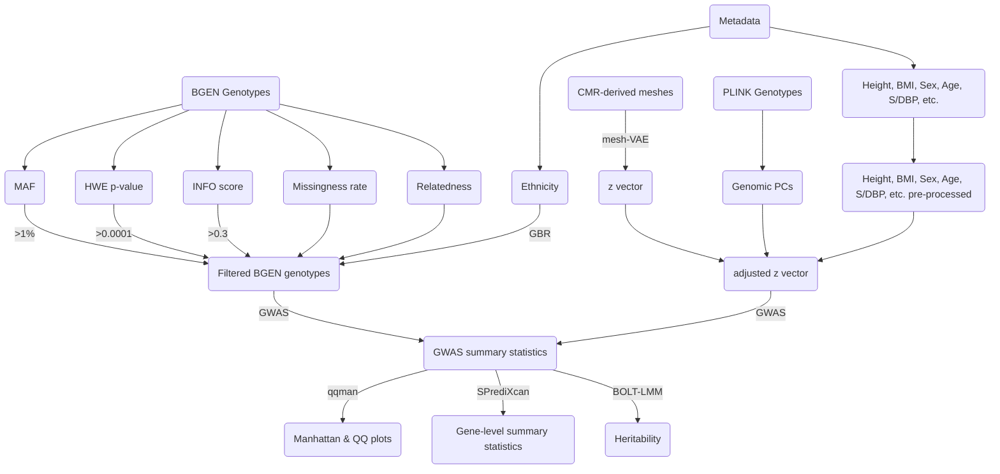

# Cardiac GWAS

Pipeline of the work conducted in this repository:

```mermaid
graph TD
%% Top Node
id1(BGEN Genotypes)
id4(CMR-derived meshes)
id3(Metadata)
id2(PLINK Genotypes)


%% Summary quantities
id1.1(MAF)
id1.2(HWE p-value)
id1.3(INFO score)
id1.4(Missingness rate)
id1.5(Relatedness)

%% Metadata items
id3.1(Ethnicity)
id3.2(Height, BMI, Sex, Age, S/DBP, etc.)

id3.2.1(Height, BMI, Sex, Age, S/DBP, etc. pre-processed)

%% Types Of Media
id1.1.1(Filtered BGEN genotypes)

id1 --> id1.1 & id1.2 & id1.3 & id1.4 & id1.5
id1.1 -- >1% --> id1.1.1
id1.2 -- >0.0001 --> id1.1.1
id1.3 -- >0.3 --> id1.1.1
id1.4 --> id1.1.1
id1.5 -->  id1.1.1

%% Genomic PCs
id2.1(Genomic PCs)
id2 --> id2.1

%% 
id3 -->  id3.1
id3 -->  id3.2
id3.1 -- GBR -->  id1.1.1

%% z vector
id4.1( z vector)
id4.1.1( adjusted z vector)

id3.2 --> id3.2.1
id4 -- mesh-VAE --> id4.1
id4.1 --> id4.1.1
id2.1 --> id4.1.1
id3.2.1 --> id4.1.1

%% GWAS summary statistics
id5(GWAS summary statistics)
id1.1.1 -- GWAS --> id5
id4.1.1 -- GWAS --> id5

id5.1(Manhattan & QQ plots)
id5.2(Gene-level summary statistics)
id5.3(Heritability)

id5 -- qqman --> id5.1
id5 -- SPrediXcan --> id5.2
id5 -- BOLT-LMM --> id5.3
```
