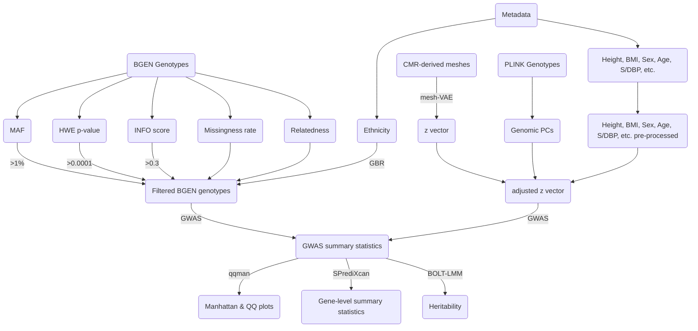

# Cardiac GWAS

### Contents

This repository contains the code for the paper _Unsupervised ensemble-based phenotyping helps enhance the discoverability of genes related to heart morphology_.

It contains two main Git submodules:  1) `CardiacCOMA` and 2) `GWAS_pipeline`.
1) implements the convolutional mesh autoencoder (CoMA). It performs the training of the network and, importantly, produces the $\textbf{z}$ latent vectors that are used as phenotypes in the subsequent GWAS. The network is implemented in `pyTorch` and `pytorch-lightning`. All run data is logged as artifacts using MLflow.
2) contains the code to perform data pre-processing for GWAS, GWAS execution and results visualization. This repository is written in R and Python. Also, several bash scripts that invoke different command-line bioinformatic tools.

Additional submodules are: 3) `CardioMesh` for cardiac 3D mesh processing, 4) `UKBB_helpers` for pre-processing UKBB data and 5) `SGE_helpers` for assisting with job distribution in an HPC using the `Son of Grid Engine` queue management system (in this case, University of Leeds' ARC).

This root repository contains code for performing MLflow queries to collect the GWAS summary statistics for differern CoMA runs into an ensemble of genetic associations for each locus. It also contains code to produce the different results figures of the paper, and to produce `LaTex` code for the different tables of results.

Finally, it contains a folder called `shiny` with source code of a R Shiny web application that allows to explore extensively the full set of results generated for this work.

### Pipeline

Pipeline of the work conducted in this repository:

